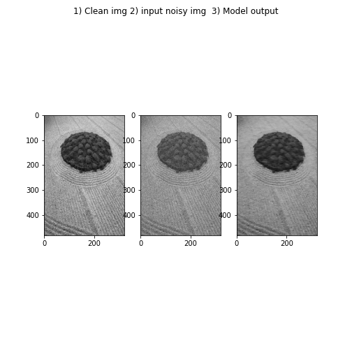
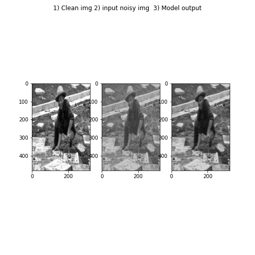

# Deep Denoise

This is a tensorflow-2 implementation of the paper [Beyond a Gaussian Denoiser: Residual Learning ofDeep CNN for Image Denoising](https://arxiv.org/pdf/1608.03981.pdf).

### Dataset used : 
[BSDS200](https://www2.eecs.berkeley.edu/Research/Projects/CS/vision/bsds/BSDS300-images.tgz)

To download and unpack run:

`wget https://www2.eecs.berkeley.edu/Research/Projects/CS/vision/bsds/BSDS300-images.tgz`

`tar -xvzf BSDS300-images.tgz` 

### Requriments : 
* tensorflow==2.3.1
* matplotlib
* numpy

### Run Model
Run train_denoise.py

### Results
After training by setting depth=5 for 25 epoch we get the below results. The original paper suggests a deeper architecture feel free to tweak the hyper params in the [train_denoise.py](train_denoise.py) file.

